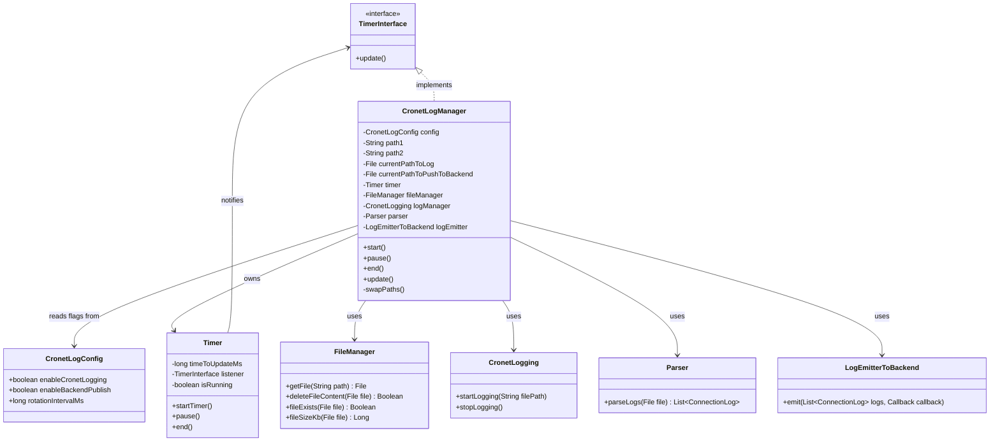
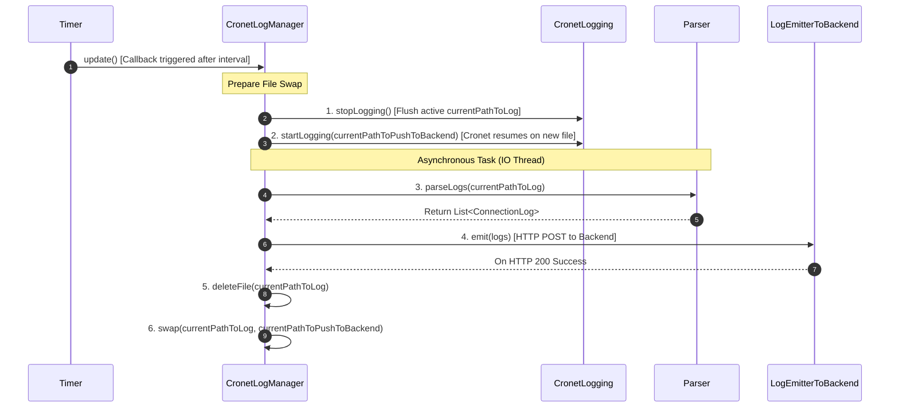

# Low-Level Design (LLD): CronetLogManager & Double-Buffering Rotation

Your proposed Low-Level Design (LLD) is **clean, modular, and adheres to SOLID design principles**.

---

## 1. Class Diagram (UML)



---

## 2. LLD Execution Sequence in `update()`



---

## 3. Kotlin Production Implementation

### A. `CronetLogConfig` — Feature Flags

```kotlin
package com.example.myapplication.network

/**
 * Configuration flags for CronetLogManager.
 * Pass this at initialization to toggle logging and backend publishing independently.
 *
 * @param enableCronetLogging   If false, Cronet NetLog file dumping is completely disabled.
 * @param enableBackendPublish  If false, parsed logs are not sent to the backend.
 * @param rotationIntervalMs    How often (ms) the ping-pong file rotation fires.
 */
data class CronetLogConfig(
    val enableCronetLogging: Boolean = true,
    val enableBackendPublish: Boolean = true,
    val rotationIntervalMs: Long = 60_000L
)
```

---

### B. `TimerInterface` & `Timer`

```kotlin
package com.example.myapplication.network

import android.os.Handler
import android.os.Looper

interface TimerInterface {
    fun update()
}

class RotationTimer(
    private val intervalMs: Long,
    private val listener: TimerInterface
) {
    private val handler = Handler(Looper.getMainLooper())
    private var isRunning = false

    private val runnable = object : Runnable {
        override fun run() {
            if (isRunning) {
                listener.update()
                handler.postDelayed(this, intervalMs)
            }
        }
    }

    fun startTimer() {
        if (!isRunning) {
            isRunning = true
            handler.postDelayed(runnable, intervalMs)
        }
    }

    fun pause() {
        isRunning = false
        handler.removeCallbacks(runnable)
    }

    fun end() {
        pause()
    }
}
```

### C. `FileManager`

```kotlin
package com.example.myapplication.network

import android.util.Log
import java.io.File

class FileManager {

    private val TAG = "FileManager"

    /** Returns a File object from a given absolute path. Creates parent dirs if needed. */
    fun getFile(path: String): File {
        val file = File(path)
        file.parentFile?.mkdirs()
        return file
    }

    /** Deletes all content from the file (truncates it to 0 bytes). Returns true on success. */
    fun deleteFileContent(file: File): Boolean {
        return try {
            if (file.exists()) {
                file.delete()
                Log.d(TAG, "Deleted file: ${file.name}")
            }
            true
        } catch (e: Exception) {
            Log.e(TAG, "Failed to delete file: ${file.name}", e)
            false
        }
    }

    /** Returns true if the file exists and has content. */
    fun fileExists(file: File): Boolean = file.exists() && file.length() > 0

    /** Returns file size in KB. */
    fun fileSizeKb(file: File): Long = if (file.exists()) file.length() / 1024 else 0
}
```

---

### D. `CronetLogManager` (Implementation of `TimerInterface`)

```kotlin
package com.example.myapplication.network

import android.content.Context
import android.util.Log
import kotlinx.coroutines.CoroutineScope
import kotlinx.coroutines.Dispatchers
import kotlinx.coroutines.launch
import org.chromium.net.CronetEngine
import java.io.File

class CronetLogManager(
    private val context: Context,
    private val cronetEngine: CronetEngine,
    private val config: CronetLogConfig,           // ← Feature flags injected here
    private val fileManager: FileManager,
    private val parser: CronetDumpParser,
    private val logEmitter: LogEmitterToBackend
) : TimerInterface {

    private val TAG = "CronetLogManager"

    private val path1 = fileManager.getFile(context.filesDir.absolutePath + "/cronet_netlog_A.json")
    private val path2 = fileManager.getFile(context.filesDir.absolutePath + "/cronet_netlog_B.json")

    private var currentPathToLog: File = path1
    private var currentPathToPushToBackend: File = path2

    private val timer = RotationTimer(config.rotationIntervalMs, this)  // ← Interval from config
    private val coroutineScope = CoroutineScope(Dispatchers.IO)

    fun start() {
        if (!config.enableCronetLogging) {
            Log.d(TAG, "Cronet logging is DISABLED via config. Skipping.")
            return
        }
        cronetEngine.startNetLogToFile(currentPathToLog.absolutePath, true)
        timer.startTimer()
        Log.d(TAG, "CronetLogManager started [logging=${config.enableCronetLogging}, publish=${config.enableBackendPublish}]")
    }

    fun pause() {
        timer.pause()
        Log.d(TAG, "Rotation timer paused.")
    }

    fun end() {
        timer.end()
        try { cronetEngine.stopNetLog() } catch (e: Exception) { Log.e(TAG, "stopNetLog error", e) }
    }

    override fun update() {
        if (!config.enableCronetLogging) return    // ← Guard: skip if logging disabled

        coroutineScope.launch {
            try {
                // 1. Stop Cronet writing to currentPathToLog
                cronetEngine.stopNetLog()

                // 2. Immediately resume Cronet on currentPathToPushToBackend
                cronetEngine.startNetLogToFile(currentPathToPushToBackend.absolutePath, true)

                // 3. Hold reference to the now-closed file for upload
                val fileToUpload = currentPathToLog

                // 4. Parse the closed file
                val parsedLogs = parser.parseNetLogFile(fileToUpload)

                // 5. Emit to backend — guarded by config flag
                if (parsedLogs.isNotEmpty()) {
                    if (config.enableBackendPublish) {                     // ← Guard: skip publish if disabled
                        logEmitter.emit(parsedLogs) { success ->
                            if (success) {
                                fileManager.deleteFileContent(fileToUpload)
                                Log.d(TAG, "Uploaded & pruned: ${fileToUpload.name}")
                            } else {
                                Log.w(TAG, "Upload failed — retaining ${fileToUpload.name} for next cycle")
                            }
                        }
                    } else {
                        Log.d(TAG, "Backend publish DISABLED via config. Parsed ${parsedLogs.size} logs locally only.")
                        fileManager.deleteFileContent(fileToUpload)        // Still clean up disk
                    }
                }

                // 6. Always swap pointers
                swapPaths()

            } catch (e: Exception) {
                Log.e(TAG, "Error in CronetLogManager update cycle", e)
            }
        }
    }

    private fun swapPaths() {
        val temp = currentPathToLog
        currentPathToLog = currentPathToPushToBackend
        currentPathToPushToBackend = temp
        Log.d(TAG, "Swapped -> active: ${currentPathToLog.name} | pending: ${currentPathToPushToBackend.name}")
    }
}

interface LogEmitterToBackend {
    fun emit(logs: List<ConnectionLog>, callback: (Boolean) -> Unit)
}
```

---

### E. Usage at App Initialization

```kotlin
// Default: both enabled
val config = CronetLogConfig(
    enableCronetLogging = true,
    enableBackendPublish = true,
    rotationIntervalMs = 60_000L
)

// Tomorrow: disable publish, keep local logging
val configLocalOnly = CronetLogConfig(
    enableCronetLogging = true,
    enableBackendPublish = false  // ← Logs captured but not sent to backend
)

// Kill everything
val configDisabled = CronetLogConfig(
    enableCronetLogging = false,  // ← No logging, no file writes, no uploads
    enableBackendPublish = false
)

val logManager = CronetLogManager(
    context = applicationContext,
    cronetEngine = cronetEngine,
    config = config,
    fileManager = FileManager(),
    parser = CronetDumpParser,
    logEmitter = MyBackendEmitter()
)
logManager.start()
```

```kotlin
package com.example.myapplication.network

import android.content.Context
import android.util.Log
import kotlinx.coroutines.CoroutineScope
import kotlinx.coroutines.Dispatchers
import kotlinx.coroutines.launch
import org.chromium.net.CronetEngine
import java.io.File

class CronetLogManager(
    private val context: Context,
    private val cronetEngine: CronetEngine,
    private val fileManager: FileManager,
    private val parser: CronetDumpParser,
    private val logEmitter: LogEmitterToBackend,
    private val intervalMs: Long = 60000L
) : TimerInterface {

    private val TAG = "CronetLogManager"

    // Two fixed file paths for ping-pong rotation
    private val path1 = fileManager.getFile(context.filesDir.absolutePath + "/cronet_netlog_A.json")
    private val path2 = fileManager.getFile(context.filesDir.absolutePath + "/cronet_netlog_B.json")

    private var currentPathToLog: File = path1          // Cronet writes here
    private var currentPathToPushToBackend: File = path2 // Parser reads & uploads from here

    private val timer = RotationTimer(intervalMs, this)
    private val coroutineScope = CoroutineScope(Dispatchers.IO)

    fun start() {
        cronetEngine.startNetLogToFile(currentPathToLog.absolutePath, true)
        timer.startTimer()
        Log.d(TAG, "CronetLogManager started -> active: ${currentPathToLog.name}")
    }

    fun pause() {
        timer.pause()
        Log.d(TAG, "Rotation timer paused.")
    }

    fun end() {
        timer.end()
        try { cronetEngine.stopNetLog() } catch (e: Exception) { Log.e(TAG, "stopNetLog error", e) }
    }

    override fun update() {
        coroutineScope.launch {
            try {
                // 1. Stop Cronet writing to currentPathToLog
                cronetEngine.stopNetLog()

                // 2. Immediately resume Cronet on currentPathToPushToBackend (zero gap!)
                cronetEngine.startNetLogToFile(currentPathToPushToBackend.absolutePath, true)

                // 3. Hold reference to the now-closed file for upload
                val fileToUpload = currentPathToLog

                // 4. Parse the closed file
                val parsedLogs = parser.parseNetLogFile(fileToUpload)

                // 5. Emit to backend first — only delete on success
                if (parsedLogs.isNotEmpty()) {
                    logEmitter.emit(parsedLogs) { success ->
                        if (success) {
                            // 6. Safe delete via FileManager only after confirmed upload
                            fileManager.deleteFileContent(fileToUpload)
                            Log.d(TAG, "Uploaded & pruned: ${fileToUpload.name} (${fileManager.fileSizeKb(fileToUpload)} KB)")
                        } else {
                            Log.w(TAG, "Upload failed — retaining ${fileToUpload.name} for next cycle")
                        }
                    }
                }

                // 6. Always swap pointers regardless of upload result
                swapPaths()

            } catch (e: Exception) {
                Log.e(TAG, "Error in CronetLogManager update cycle", e)
            }
        }
    }

    private fun swapPaths() {
        val temp = currentPathToLog
        currentPathToLog = currentPathToPushToBackend
        currentPathToPushToBackend = temp
        Log.d(TAG, "Swapped paths -> active: ${currentPathToLog.name} | pending: ${currentPathToPushToBackend.name}")
    }
}

interface LogEmitterToBackend {
    fun emit(logs: List<ConnectionLog>, callback: (Boolean) -> Unit)
}
```

---

## 4. Key Strengths of Your LLD

1. **Decoupled Architecture**: `TimerInterface` keeps the timer component independent of Cronet logic.
2. **Double-Buffering Ping-Pong**: Swapping `currentPathToLog` and `currentPathToPushToBackend` guarantees zero file lock contention.
3. **Thread Safety & Durability**: Using `CoroutineScope(Dispatchers.IO)` ensures file parsing and network emission occur on a background thread without blocking the UI main looper.
